# HOTEL MANAGEMENT SYSTEM 
algoritma ve programlama dersi final ödevi için yaptığım otel yönetim otomasyonu projesidir. java ile yazıldı.

## Table of Contents

- [About](#about)
- [Getting Started](#getting_started)
- [Usage](#usage)
- [Contact](#contact)

## About
Otel yönetim otomasyonu kullanıcıların otele kayıt olup, check-in ve check-out işlemleri yapmasını sağlar. Check-in işlemi sırasında kullanıcılar istedikleri özellikleri belirler ve sistem bu özelliklere uygun bir odayı ve fiyatı otomatik olarak verir. Check-out işlemi sırasında kullanıcılar oda numarasını girdiğinde kaç gün kaldığı ve ne kadar ücret ödemesi gerektiğini görür, ardından ödeme sayfasına yönlendirilir. kullanıcılar profilini düzenleyebilir, şifre değiştirebilir.

Ayrıca otel yönetim otomasyonunda yönetici olarak giriş yapan kullanıcı hangi odada kimin ne kadar süredir kaldığını görebilir, check-in ve check-out yapabilir, oda ekleyip silebilir ve odaların özelliklerini değiştirebilir.

Otel Yönetim Otomasyonu projesinin sınıf diyagramı aşağıdaki gibidir:

```mermaid
classDiagram
direction BT
class BkashPayment {
  ~ JTextField num_fld
  ~ JButton back_btn
  ~ JPasswordField pass_fld
  ~ JLabel bkash_lbl
  ~ JButton next_btn
  + actionPerformed(ActionEvent) void
  + inputLength(JTextField, JPasswordField) boolean
  + confirmPayment(boolean, boolean, JFrame, JTextField, JPasswordField) void
  + inputValidation(JTextField, JPasswordField) boolean
}
class CheckIn {
  - JButton back_btn
  - JTextField cost_fld
  - JComboBox~String~ roomNo_Box
  - JComboBox~String~ bed_Box
  - JTextField name_field
  - JTextField mbl_fld
  - JTextField address_fld
  + String roomNo
  - JButton clear_btn
  - JTextField date_fld
  - JButton confirm_btn
  - JFrame frame
  - JTextField nationality_fld
  - JComboBox~String~ gender_Box
  - JComboBox~String~ roomType_Box
  - JTextField gmail_fld
  - JButton logOut_Btn
  + actionPerformed(ActionEvent) void
  + WriteCheckinData(String, String, String, String, String, String, String, File, String, String) void
}
class CheckOut {
  - JComboBox~String~ search_combo
  - JTextField totalAmount_fld
  - JButton logOut_btn
  ~ String roomType
  ~ String bed
  ~ String roomNumToDelete
  - JButton clear_btn
  - JTextField dayStay_fld
  ~ String gmail
  - JTextField email_fld
  ~ String roomPrice
  - JTextField checkInDate_fld
  - JTable table
  - JTextField CustomerNum_fld
  ~ String gender
  - JTextField CustomerName_fld
  ~ String nationality
  ~ String address
  ~ String roomNo_B
  ~ String CheckinDate
  - JButton back_btn
  - JTextField pricePerDay_fld
  - JButton checkOut_btn
  ~ String mobileNumber
  ~ String name
  + getCustomerData() void
  + roomSearch() void
  + deleteRoomEntry() void
  + actionPerformed(ActionEvent) void
}
class CheckOutRoomSearch {
<<Interface>>
  + deleteRoomEntry() void
}
class ClearCheckOut {
<<Interface>>
  + ClearCheckoutField(JTextField, JTextField, JTextField, JTextField, JTextField, JTextField, JTextField, JComboBox~String~, JTable) void
}
class ConfirmPayment {
<<Interface>>
  + confirmPayment(boolean, boolean, JFrame, JTextField, JPasswordField) void
  + inputLength(JTextField, JPasswordField) boolean
  + inputValidation(JTextField, JPasswordField) boolean
}
class CustomerDataEntry {
<<Interface>>
  + getCustomerData() void
}
class DashBoard {
  - JButton Manage_btn
  - JButton checkinButton
  - JButton checkoutButton
  - JButton logoutButton
  + actionPerformed(ActionEvent) void
}
class Edit {
  - JLabel full
  - JLabel phone
  - JTextField userField
  - JButton logoutButton
  - JButton usernameButton
  - JButton confirmButton3
  - JButton confirmButton2
  - JButton fullNameButton
  - JButton phoneButton
  - JButton confirmButton1
  - JLabel user
  - int check
  - JButton backButton
  - JTextField phoneField
  - JButton exitButton
  - JTextField fullField
  + actionPerformed(ActionEvent) void
  + isValidFullname(String) boolean
}
class ForgetPass {
  - JButton exitButton
  - JTextField userField
  - JButton backButton
  - JButton nextButton
  # int deleteLine
  + actionPerformed(ActionEvent) void
}
class ForgetPass2 {
  - JButton next2Button
  - JButton backButton
  - JButton exitButton
  - JTextField phoneField
  + actionPerformed(ActionEvent) void
}
class ForgetPass3 {
  - JButton backButton
  - JToggleButton EyeBtn1
  - ImageIcon on
  - JButton next3Button
  - JPasswordField newPass
  - JPasswordField confirmPass
  - ImageIcon off
  - JToggleButton EyeBtn2
  - JButton exitButton
  + actionPerformed(ActionEvent) void
}
class Login {
  - JButton signup
  # String fullName
  - ImageIcon on
  # String fullUsername
  # boolean isAdmin
  - JPasswordField passwordField
  - JToggleButton EyeBtn
  # boolean loginFlag
  - JTextField usernameField
  # String phoneNumber
  - JButton loginButton
  # String oldPassword
  - ImageIcon off
  - JButton forgot
  + String USERNAME
  - JButton exitButton
  + getloginFlag() boolean
  + actionPerformed(ActionEvent) void
}
class Main {
  + main(String[]) void
}
class ManageRoom {
  - JButton del_btn
  - JButton logOut_btn
  - JButton back_btn
  - JTable table
  - JTextField roomNum_fld
  - JComboBox~String~ bed_box
  - JButton add_btn
  - JTextField price_fld
  - JComboBox~String~ roomType_box
  + actionPerformed(ActionEvent) void
}
class NagadPayment {
  ~ JTextField num_fld
  ~ JButton next_btn
  ~ JLabel bkash_lbl
  ~ JButton back_btn
  ~ JPasswordField pass_fld
  + actionPerformed(ActionEvent) void
}
class Payment {
  ~ JRadioButton bkash_btn
  ~ JRadioButton nagad_btn
  ~ ButtonGroup bkashNagad_grp
  ~ JButton next_btn
  ~ JLabel payment_lbl
  + actionPerformed(ActionEvent) void
}
class Profile {
  - JButton backButton
  - JButton logoutButton
  - JButton exitButton
  - JButton editButton
  + actionPerformed(ActionEvent) void
}
class ShowRoom {
  + roomDetails(JTextField, JComboBox~String~, JComboBox~String~, JComboBox~String~) void
}
class Signup {
  - ImageIcon on
  - JButton exitButton
  - JTextField phoneNumberField
  - JButton signin
  - JPasswordField passwordField
  - JPasswordField confirmPassField
  - JButton signup
  - ImageIcon off
  - JToggleButton EyeBtn
  - JToggleButton EyeBtn2
  - JTextField usernameField
  - JTextField fullField
  + actionPerformed(ActionEvent) void
  + isValidFullname(String) boolean
  + validateUsername(String) boolean
}
class UCheckIn {
  - JButton confirm_btn
  - JButton clear_btn
  - String fullName
  - JComboBox~String~ gender_Box
  + String roomNo
  - JTextField address_fld
  - JButton back_btn
  - JTextField cost_fld
  - JTextField date_fld
  - JTextField gmail_fld
  - JTextField nationality_fld
  - JTextField name_field
  - JComboBox~String~ bed_Box
  - JTextField mbl_fld
  - JComboBox~String~ roomType_Box
  - JFrame frame
  - JButton logOut_Btn
  - String MobileNumber
  - JComboBox~String~ roomNo_Box
  + actionPerformed(ActionEvent) void
  + WriteCheckinData(String, String, String, String, String, String, String, File, String, String) void
}
class UCheckOut {
  ~ String address
  - JButton back_btn
  ~ String CheckInDate
  - DefaultTableModel model
  ~ String name
  - JComboBox~String~ roomNum_combo
  - JTextField checkInDate_fld
  - JButton checkOut_btn
  ~ String roomType
  - JTextField customerNum_fld
  - JButton logOut_btn
  - JTable table
  - JTextField checkOut_fld
  ~ String bed
  - JButton clear_btn
  ~ String nameLogin
  ~ String roomNo_B
  ~ String roomPrice
  ~ String MobileNumber
  - JTextField totalAmount_fld
  ~ String nationality
  - JTextField email_fld
  ~ String gender
  - JTextField customerName_fld
  - JTextField pricePerDay_fld
  - JTextField dayStay_fld
  ~ String gmail
  + getCustomerData() void
  + deleteRoomEntry() void
  + actionPerformed(ActionEvent) void
}
class UDashBoard {
  - JButton profile_btn
  - JButton checkOut_btn
  - JButton logoutBtn
  - JButton checkIn_btn
  + actionPerformed(ActionEvent) void
}
class WriteCheckInInfo {
<<Interface>>
  + WriteCheckinData(String, String, String, String, String, String, String, File, String, String) void
}

BkashPayment  ..>  ConfirmPayment 
CheckIn  -->  ShowRoom 
CheckIn  ..>  WriteCheckInInfo 
CheckOut  ..>  CheckOutRoomSearch 
CheckOut  ..>  ClearCheckOut 
CheckOut  ..>  CustomerDataEntry 
NagadPayment  ..>  ConfirmPayment 
UCheckIn  -->  ShowRoom 
UCheckIn  ..>  WriteCheckInInfo 
UCheckOut  ..>  CheckOutRoomSearch 
UCheckOut  ..>  CustomerDataEntry 
 


```



## Getting Started
Hotel Management System projesini kendi cihazınızda çalıştırmak için aşağıdaaki adımları izleyin:

1. Bu repo'yu clone'layın:
   ```
   git clone https://github.com/frauvate/hotel-management-system.git
   ```

2. Projenin dosya yoluna gidin:
   ```
   cd hotel-management-system
   ```

3. `Main.java` dosyasını `javac` kullanarak derleyin:
   ```
   javac Main.java
   ```

4. Derlenen `Main` class ile projeyi başlatın:
   ```
   java Main
   ```

5. Aplikasyon şu anda çalışıyor olmalı.

## Usage


## Contact
esmaasyldrm@gmail.com 
